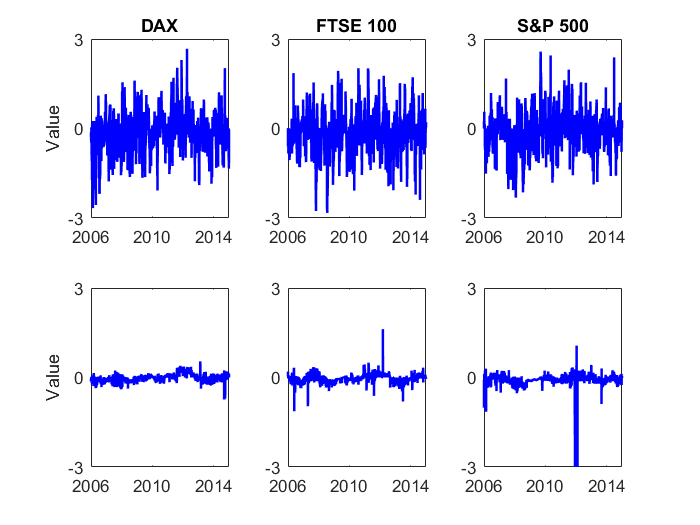

##  **LCARE_Estimate_Rolling_001**


```yaml

Name of QuantLet : LCARE_Estimate_Rolling_001

Published in : LCARE

Description : 'Estimates the parameters of CARE model with fix rolling window for selected indices. Selected rolling window lengths: 1 month (20 days), 3 months (60 days), 6 months 
(125 days) and 12 months (250 days) for tau = 0.01.'

Keywords:
- estimation
- empirical
- time-series
- parameter
- returns
- regression
- expectile
- market
- time varying
- plot
- risk management
- index
- dax
- ftse100

See also: 

Author: Andrija Mihoci, Xiu Xu

Submitted: Thu, November 12 2015 by Xiu Xu

Datafile: DataIndices.dat

Input: DataIndices.dat

Output: LCARE_Estimate_Rolling_001.png

Example: 'Plots of the second parameter of CARE model with different fixed 
rolling windows (the second parameter alpha1).'
```




```R


 
clear all; clc;
 
data   = load('DataIndices.dat');
r_DAX  = diff(log(data(:, 1)));        
r_FTSE = diff(log(data(:, 2)));       
r_SP   = diff(log(data(:, 3)));       
tau    = 0.01;                         
roll   = [20 60 125 250];
n      = length(data) - 1;
first  = 261;                       
 
paras_DAX  = zeros(n - first + 1, 5 * length(roll));
paras_FTSE = zeros(n - first + 1, 5 * length(roll));
paras_SP   = zeros(n - first + 1, 5 * length(roll));
 
for i = 1 : 1 : length(roll)
    
    [out_DAX]  = LCARE_Estimation_Rolling(r_DAX, roll(i), first, tau);
    [out_FTSE] = LCARE_Estimation_Rolling(r_FTSE, roll(i), first, tau);
    [out_SP]   = LCARE_Estimation_Rolling(r_SP, roll(i), first, tau);
    
    paras_DAX(:, (5 * i - 4) : 5 * i)  = out_DAX(:, 1 : 5);
    paras_FTSE(:, (5 * i - 4) : 5 * i) = out_FTSE(:, 1 : 5);
    paras_SP(:, (5 * i - 4) : 5 * i)   = out_SP(:, 1 : 5);
 
end
 
save tau_001.mat;
 
figure;
subplot(2, 3, 1); plot(paras_DAX(:, 2), '-b', 'LineWidth', 1.5); title('DAX');
ylabel('Value'); ylim([-3, 3]); xlim([1, 2348]); 
Year     = {'2006', '2010', '2014'}; hold on; set(gca, 'xtick', [1  1045 2088]);
Estimate = {'-3', '0', '3'}; hold on; set(gca, 'ytick', [-3 0 3]);
set(gca, 'xticklabel', Year); set(gca, 'yticklabel', Estimate);
 
subplot(2, 3, 4); plot(paras_DAX(:, 17), '-b', 'LineWidth', 1.5);
ylabel('Value'); ylim([-3, 3]); xlim([1, 2348]); 
Year     = {'2006', '2010', '2014'}; hold on; set(gca, 'xtick', [1  1045 2088]);
Estimate = {'-3', '0', '3'}; hold on; set(gca, 'ytick', [-3 0 3]);
set(gca, 'xticklabel', Year); set(gca, 'yticklabel', Estimate);
 
subplot(2, 3, 2); plot(paras_FTSE(:, 2), '-b', 'LineWidth', 1.5); title('FTSE 100');
ylabel(''); ylim([-3, 3]); xlim([1, 2348]); 
Year     = {'2006', '2010', '2014'}; hold on; set(gca, 'xtick', [1  1045 2088]);
Estimate = {'-3', '0', '3'}; hold on; set(gca, 'ytick', [-3 0 3]);
set(gca, 'xticklabel', Year); set(gca, 'yticklabel', Estimate);
 
subplot(2, 3, 5); plot(paras_FTSE(:, 17), '-b', 'LineWidth', 1.5);
ylabel(''); ylim([-3, 3]); xlim([1, 2348]); 
Year     = {'2006', '2010', '2014'}; hold on; set(gca, 'xtick', [1  1045 2088]);
Estimate = {'-3', '0', '3'}; hold on; set(gca, 'ytick', [-3 0 3]);
set(gca, 'xticklabel', Year); set(gca, 'yticklabel', Estimate);
 
subplot(2, 3, 3); plot(paras_SP(:, 2), '-b', 'LineWidth', 1.5); title('S&P 500');
ylabel(''); ylim([-3, 3]); xlim([1, 2348]); 
Year     = {'2006', '2010', '2014'}; hold on; set(gca, 'xtick', [1  1045 2088]);
Estimate = {'-3', '0', '3'}; hold on; set(gca, 'ytick', [-3 0 3]);
set(gca, 'xticklabel', Year); set(gca, 'yticklabel', Estimate);
 
subplot(2, 3, 6); plot(paras_SP(:, 17), '-b', 'LineWidth', 1.5);
ylabel(''); ylim([-3, 3]); xlim([1, 2348]); 
Year     = {'2006', '2010', '2014'}; hold on; set(gca, 'xtick', [1  1045 2088]);
Estimate = {'-3', '0', '3'}; hold on; set(gca, 'ytick', [-3 0 3]);
set(gca, 'xticklabel', Year); set(gca, 'yticklabel', Estimate);


```
